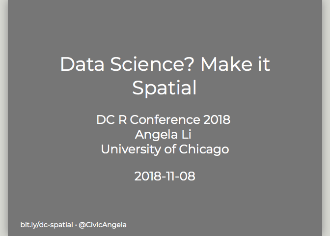

Data Science? Make It Spatial
=============================

This is a talk given by Angela Li of the [Center for Spatial Data Science (CSDS)](https://spatial.uchicago.edu) at UChicago for [DC R Conference 2018](https://rstats.ai). The goal was to introduce spatial analysis methods to a crowd that was deeply familiar with R, but new to spatial analysis.

Below are the slides from the talk. The shortlink to the slides is [bit.ly/dc-spatial](bit.ly/dc-spatial) for easy reference.

Packages Used:
--------------

-   [`sf`](https://r-spatial.github.io/sf/index.html)
-   [`leaflet`](https://rstudio.github.io/leaflet/)
-   [`tmap`](https://github.com/mtennekes/tmap)
-   [`tidycensus`](https://walkerke.github.io/tidycensus/index.html)

References
----------

Thanks to [Garrick Aden-Buie](https://github.com/gadenbuie) for the [`xaringanthemer`](https://github.com/gadenbuie/xaringanthemer) package.

Note: For exporting xaringan slides to a PDF, I used the `webshot` package, instructions for which are found in the [xaringan wiki](https://github.com/yihui/xaringan/wiki/Export-Slides-to-PDF).

Contact Me
----------

Feel free to email me at <ali6@uchicago.edu> or reach out [on Twitter](https://twitter.com/CivicAngela).
