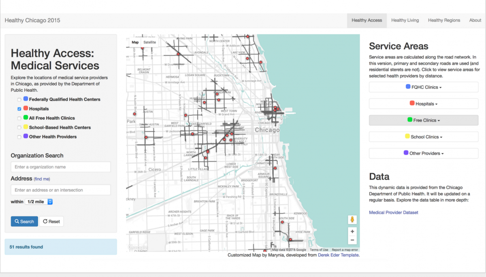
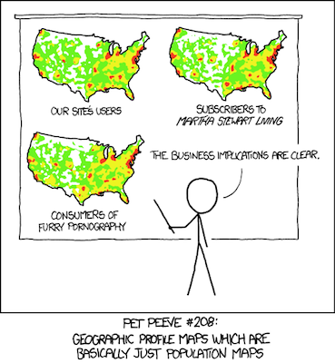
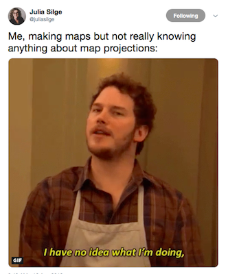

```{r setup, include=FALSE}
options(htmltools.dir.version = FALSE)
library(tidyverse)
library(sf)
```

```{r xaringan-themer, include=FALSE}
library(xaringanthemer)
duo_accent(
  primary_color = "#767676",
  secondary_color = "#800000",
  title_slide_text_color = "#FEFEFE",
  header_font_google = google_font("Montserrat"),
  text_font_google   = google_font("Montserrat", "400", "400i"),
  code_font_google   = google_font("Source Code Pro"),
  table_row_even_background_color = "#D6D6CE"
)
```
# About me


--

- R Spatial Advocate at Center for Spatial Data Science, UChicago

--

- Founder of R-Ladies Chicago

--

- Wrote a thesis using spatial econometrics...

--

- About property values in Detroit...

--

- Under Luc Anselin, who literally wrote the book on spatial econometrics

---
class: inverse, center, middle

# Geography?

---


---
class: inverse, center, middle

# Geography!

---



---
class: inverse, middle, center

# What's exploratory *spatial* data analysis (ESDA)?

---
class: inverse, middle, center

# Making lots of maps!


---
<!-- # Read in data -->

<!-- I can read in straight GeoJSON files with `sf` -->

# Data: crimes in DC in the last 30 days

```{r warning=FALSE, message=FALSE}
library(sf)
dc_crime <- st_read("https://opendata.arcgis.com/datasets/dc3289eab3d2400ea49c154863312434_8.geojson")
```

---
# Look at observations

```{r echo=FALSE, warning=FALSE}
library(janitor)
library(DT)
dc_crime <- clean_names(dc_crime) %>% 
  select(-census_tract) # For expository purposes, getting rid of this
```

```{r eval=FALSE}
head(dc_crime)
```

```{r echo=FALSE}
dc_crime %>% 
  mutate(attributes = "...") %>% 
  select(report_dat, offense, attributes, geometry) %>% 
  head()
```

---
# Map it!

```{r out.width='100%', fig.height=4.5, eval=require('leaflet')}
library(leaflet)
leaflet() %>% 
  addTiles() %>% 
  addCircles(data = dc_crime, color = "#800000")
```

---
# Change into a heatmap

```{r out.width='100%', fig.height=4, eval=require('leaflet'), warning=FALSE}
library(leaflet.extras)
leaflet() %>% 
  addTiles() %>% 
  addHeatmap(data = dc_crime, max = 0.7, blur = 60)
```

---
class: center

# The problem with heat maps



---
class: inverse, middle, center

# I want to adjust for population

--

## But, population data is collected in specific geographic units

---
# Census tract polygons!
```{r echo=FALSE, warning=FALSE, message=FALSE}
dc_tracts <- readRDS("dc_tracts.Rda") %>% 
  rename(census_tract = tractce)
```

```{r out.width='100%', fig.height=5, eval=require('leaflet'), warning=FALSE}
leaflet() %>% 
  addTiles() %>% 
  addPolygons(data = dc_tracts, weight = 2)
```

---
# Add crimes as a layer

```{r warning = FALSE, out.width='100%', fig.height=4.5, eval=require('leaflet')}
leaflet() %>% 
  addTiles() %>% 
  addPolygons(data = dc_tracts, weight = 2) %>% 
  addCircles(data = dc_crime, col = "red", radius = 0.01)
```

---
class: inverse, middle, center

# How many crimes happened in each tract?

--

## Spatial aggregation

--

## Point-in-polygon analysis

---
# Count points in polygons

```{r eval=FALSE, error=TRUE}
st_join(dc_crime, dc_tracts["census_tract"])
```

```{r}
# Error: st_crs(x) == st_crs(y) is not TRUE
```

--
## What's the error???

---
class: inverse, center, middle

# Warning: worst part of working with spatial data ahead

---
class: center

# Projections!

---
class: center, middle, inverse

# Dealing with projections = spatial data munging


---
class: center

# What's actually going on


---
# Check the projections!

--

```{r}
st_crs(dc_crime)
```

--

```{r}
st_crs(dc_tracts)
```

---
# Make them the same

```{r}
dc_crime <- st_transform(dc_crime, 102285)
dc_tracts <- st_transform(dc_tracts, 102285) 
```

--

```{r}
st_crs(dc_crime)
```

--

```{r}
st_crs(dc_tracts)
```

---

# Try the spatial join again

```{r }
dc_crime <- st_join(dc_crime, dc_tracts["census_tract"])
```
```{r echo=FALSE}
dc_crime %>% 
  mutate(attributes = "...") %>% 
  select(census_tract, report_dat, offense, attributes, geometry) %>% 
  head(4)
```

---
class: inverse, middle, center

# It worked!

---
# Map crime counts
```{r echo=FALSE, warning=FALSE}
crimes_by_tract <- dc_crime %>% 
  group_by(census_tract) %>% 
  tally() %>% 
  `st_geometry<-`(NULL) %>% 
  left_join(dc_tracts, ., by = "census_tract") %>% 
  rename(number_crimes = n) 
```

```{r echo=FALSE, warning=FALSE, fig.height=6}
library(tmap)
tm_shape(crimes_by_tract) +
  tm_polygons("number_crimes")
```

---
class: inverse, center, middle

# This map makes a cartographer sad :(

--

## We're mapping a spatially extensive variable

--

## Aka the count is related to the area of the tract

---
# Fix this by dividing by population

```{r warning=FALSE, message=FALSE}
library(tidycensus)
dc_pop <- get_decennial(geography = "tract", 
                        variables = c("H0100001"), 
                        state = "DC")
```

```{r echo=FALSE, warning=FALSE}
dc_pop <- dc_pop %>% 
  mutate(census_tract = str_sub(GEOID, 6, 11)) %>% 
  rename(pop = value)
```
--

```{r warning=FALSE}
head(dc_pop, 4)
```

---
# Map crime rates per capita
```{r echo=FALSE, warning=FALSE, fig.height=6}
crime_per_cap <- dc_pop %>% 
  left_join(crimes_by_tract, ., by = "census_tract") %>% 
  mutate(crime_by_capita = number_crimes/pop)
```

```{r echo=FALSE, fig.height=5}
tm_shape(filter(crime_per_cap, crime_by_capita < .1)) +
  tm_polygons("crime_by_capita", style = "jenks")
```
---
class: inverse, middle, center

# Are crime rates and median income related?

---
# Get median income by tract 
```{r}
dc_inc <- get_acs(geography = "tract", 
                  variables = c("B19013_001"), 
                  state = "DC")
```
---
# Get median income by tract 
```{r}
head(dc_inc)
```

---
# Map crimes and median income

```{r echo=FALSE}
dc_inc <- clean_names(dc_inc) %>% 
  mutate(census_tract = str_sub(geoid, 6, 11)) %>% 
  select(med_inc = estimate, census_tract) %>% 
  left_join(crime_per_cap, ., 
                    by = "census_tract")
```

```{r echo=FALSE, fig.height=5}
tm_shape(dc_inc) +
  tm_polygons("med_inc") +
  tm_shape(dc_crime) +
  tm_dots(size = 0.05)
```
<!-- --- -->
<!-- # Add a basemap and a legend -->

<!-- ```{r eval=FALSE} -->
<!-- tmap_mode("view") -->
<!-- tm_shape(dc_inc) + -->
<!--   tm_polygons("med_inc") + -->
<!--   tm_shape(dc_crime) + -->
<!--   tm_dots() + -->
<!--   tm_view(alpha = 1, -->
<!--           basemaps = "CartoDB.Positron", -->
<!--           legend.position = c("left", "bottom")) -->
<!-- ``` -->
<!-- --- -->
<!-- # Add a basemap and a legend -->

<!-- ```{r echo=FALSE, fig.height=5} -->
<!-- tmap_mode("view") -->
<!-- tm_shape(dc_inc) + -->
<!--   tm_polygons("med_inc") + -->
<!--   tm_shape(dc_crime) + -->
<!--   tm_dots() + -->
<!--   tm_view(alpha = 1, -->
<!--           basemaps = "CartoDB.Positron", -->
<!--           legend.position = c("left", "bottom")) -->
<!-- ``` -->

---
class: center, middle, inverse

# I'll end it here, but...

---

class: center, middle

## There might be other local demographic & socioeconomic factors that affect crime rates

### (spatial regression, modeling)
---
class: center, middle

## Crime in one area may be linked to crime in another area

### (spatial autocorrelation)

---
class: center, middle

## I might be interested in spots where crime is abnormally high or low

### (spatial clustering)

---
class: inverse, center, middle

# Thanks!
